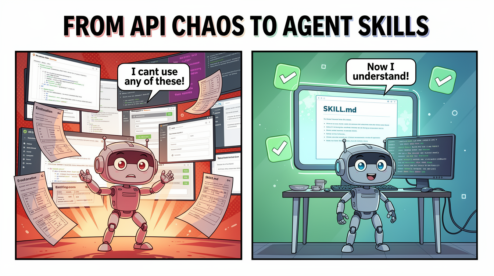
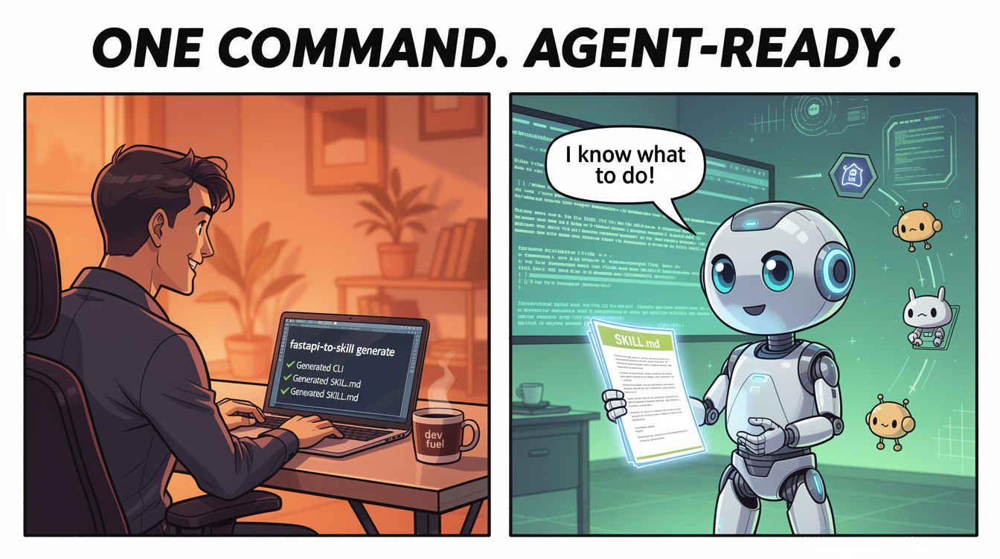

# fastapi-to-skill

> Convert any FastAPI app or OpenAPI spec into a CLI + SKILL.md for AI agents — in one command.



```bash
pip install fastapi-to-skill
fastapi-to-skill generate main:app -o ./skills/myapi/
```



---

## The Problem

A year ago, APIs served frontends. Developers read docs, learned the UI, wrote integration code.

Now APIs serve AI agents. And agents don't read docs — they read **skill files**.

If your product has no `SKILL.md`, agents can't discover it, can't use it, and will use a competitor that does have one.

The new distribution channel is not the App Store. It's the agent skill registry.

---

## The Solution

`fastapi-to-skill` takes your existing FastAPI app (or any OpenAPI spec) and generates everything an AI agent needs to use your API:

| Output | What it is |
|--------|-----------|
| `cli.py` | Standalone Typer CLI — one command per endpoint, no deps on this tool |
| `SKILL.md` | Universal skill file for Claude Code, OpenClaw, and any Agent Skills-compatible platform |
| `openapi.json` | Copy of the spec for reference |
| `pyproject.toml` | Install the CLI as a named command (`pip install -e .`) |

**No MCP server. No AI costs. No infrastructure. Just files.**

---

## Why FastAPI?

FastAPI auto-generates an OpenAPI spec from your Python type hints. You write:

```python
@app.post("/tasks")
def create_task(task: Task) -> TaskOut:
    ...
```

FastAPI gives you a full API contract for free — endpoints, parameters, request bodies, types, auth schemes. Always in sync with your code. No manual YAML.

`fastapi-to-skill` reads that spec with one call to `app.openapi()` and turns it into agent-ready tools. The whole pipeline is: **your type hints → OpenAPI spec → CLI + SKILL.md**.

Big thanks to [@sebastianramirez](https://github.com/tiangolo) for building FastAPI + Typer — an ecosystem where this kind of tooling is possible in a weekend.

---

## Quick Start

### Install

```bash
pip install fastapi-to-skill
# or for global CLI tools (recommended)
pipx install fastapi-to-skill
```

### Generate from a FastAPI app

```python
# main.py
from fastapi import FastAPI
from pydantic import BaseModel

app = FastAPI(title="Task Manager API")

class Task(BaseModel):
    title: str
    done: bool = False

@app.post("/tasks")
def create_task(task: Task):
    ...

@app.get("/tasks/{task_id}")
def get_task(task_id: int):
    ...
```

```bash
fastapi-to-skill generate main:app -o ./skills/task-manager/
```

Output:
```
skills/task-manager/
├── cli.py          ← standalone CLI
├── SKILL.md        ← agent skill file
├── openapi.json    ← spec copy
└── pyproject.toml  ← install as named command
```

### Install and use the generated CLI

```bash
cd skills/task-manager/
pip install -e .

# Run without a command — shows SKILL.md (AI-friendly)
task-manager-api

# List all commands
task-manager-api --help

# See body schema for any command
task-manager-api create-task --help
# Body fields:
#   title: string (required)
#   done: boolean  default: False

# Call the API
task-manager-api create-task --body '{"title": "Ship the feature"}'
task-manager-api get-task 1
task-manager-api list-tasks --done false

# Search commands by keyword
task-manager-api search "task"
```

### Generate from an OpenAPI spec file

```bash
fastapi-to-skill generate --spec openapi.json -o ./skills/myapi/
fastapi-to-skill generate --spec openapi.yaml -o ./skills/myapi/
```

### Choose target platform

```bash
# Claude Code (default)
fastapi-to-skill generate main:app -t claude-code

# OpenClaw
fastapi-to-skill generate main:app -t openclaw
```

### Other options

```bash
# Preview without writing files
fastapi-to-skill generate main:app --dry-run

# Validate spec only
fastapi-to-skill generate main:app --validate

# Override base URL
fastapi-to-skill generate main:app --base-url https://api.myapp.com
```

---

## Authentication

Set your credentials via environment variables before calling any command:

```bash
# API key
export MYAPI_API_KEY="sk-your-key"

# Bearer token
export MYAPI_TOKEN="your-token"

# Custom base URL
export MYAPI_BASE_URL="https://api.myapp.com"
```

The env var prefix is derived from your API title automatically.

---

## How the SKILL.md works

When an AI agent encounters your CLI, it runs:

```bash
task-manager-api          # reads SKILL.md, understands the API
task-manager-api --help   # sees all available commands
task-manager-api create-task --help  # sees body schema
```

No human needed. The agent discovers capabilities, reads the contract, and starts calling commands.

The `SKILL.md` follows the [Agent Skills open standard](https://agentskills.io) — compatible with Claude Code, OpenClaw, and any platform that supports it.

---

## License

MIT

---

*Built on [FastAPI](https://github.com/fastapi/fastapi) + [Typer](https://github.com/fastapi/typer) by Sebastian Ramirez.*
